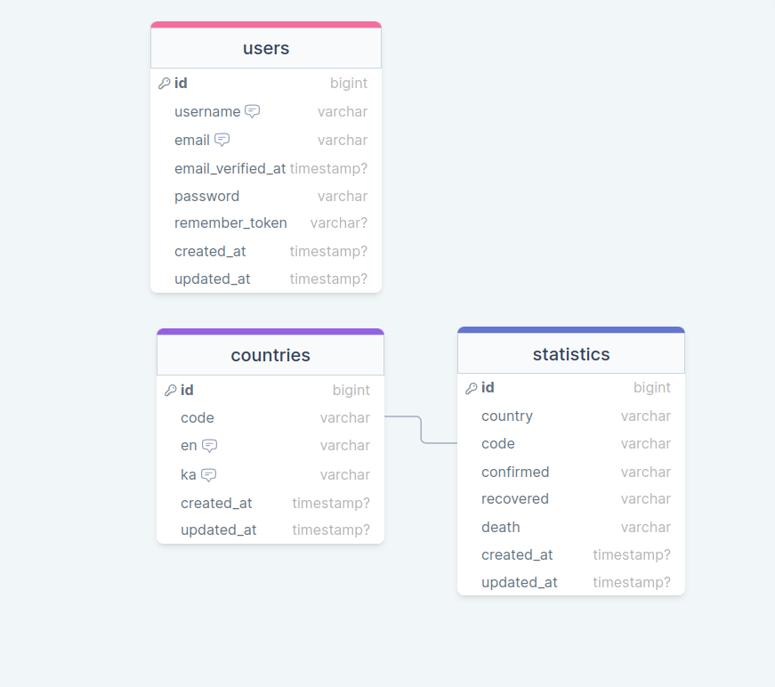

# Coronatime App

The coronatime app requires for the user to register and verify email address in order to use the app. Once the user logs in, they'll be able to see the statistics of recovered, confirmed and dead people by COVID-19.
## Table of Contents
* [Features](#features)
* [Tech Stack](#tech-stack)
* [Installation](#getting-started)
* [Resources](#resources)
* [Commit Rules](#commit-rules)
* [Database Structure](#database-structure)
## Features

- Georgian and English languages support
- Search countries in both languages
- Sort by different values
- Responsive Design
- Tests (100% Coverage)
- Validation in Back-end
- Validation in Front-end
- Password Reset function
- Email Verification function


## Tech Stack

**Client:** HTML, TailwindCSS, Vanilla JavaScript.

**Server:** Laravel 9, MySQL.


## Getting Started

Clone movie-quotes

```bash
    git clone https://github.com/RedberryInternship/gigi-coronatime.git
```
Install composer with terminal

```bash
    composer install
```
Install npm with terminal

```bash
    npm install
```
Host on local server

```bash
    php artisan serve
    npm run dev
```

    
## Resources

 - [Figma Design](https://www.figma.com/file/O9A950iYrHgZHtBuCtNSY8/Coronatime?t=6OEPODjyXmwpFglz-0)
 - [Inter Font](https://fonts.google.com/specimen/Inter)
 - [FiraGO Font](https://bboxtype.com/typefaces/FiraGO/#!layout=specimen)
 - [API Reference](https://devtest.ge/api)


## Commit Rules
Link: https://redberry.gitbook.io/resources/other/git-is-semantikuri-komitebi

## Database Structure
[Link](https://drawsql.app/teams/gigi/diagrams/coronatime)


